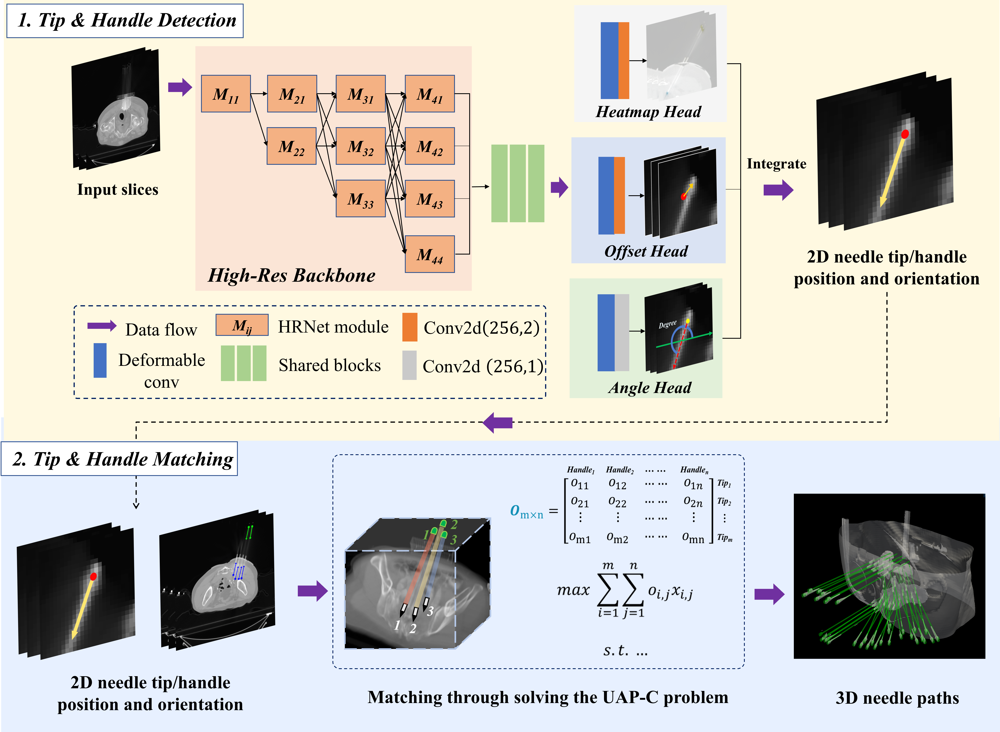

# CTNeedleLocalization

Official Code of  
**“Multi-needle Localization for Pelvic Seed Implant Brachytherapy based on Tip-handle Detection and Matching”**

---

## 📝 Citation

If you find this work or code useful for your research, please cite our paper:

```bibtex
@misc{xiao2025multineedlelocalizationpelvicseed,
      title={Multi-needle Localization for Pelvic Seed Implant Brachytherapy based on Tip-handle Detection and Matching}, 
      author={Zhuo Xiao and Fugen Zhou and Jingjing Wang and Chongyu He and Bo Liu and Haitao Sun and Zhe Ji and Yuliang Jiang and Junjie Wang and Qiuwen Wu},
      year={2025},
      eprint={2509.17931},
      archivePrefix={arXiv},
      primaryClass={cs.CV},
      url={https://arxiv.org/abs/2509.17931}
}
```

---

## 📌 Overview

This repository provides a complete pipeline for **automatic multi-needle localization in intraoperative CT** for pelvic seed implant brachytherapy.

The framework consists of two stages:

1. **2D Detection**  
   Slice-wise detection of needle tips and handles.

2. **3D Matching and Reconstruction**  
   Greedy matching and merging of tip–handle pairs to reconstruct full 3D needle trajectories.

---

## 🔄 Workflow

The overall workflow of the proposed method is illustrated below.



The pipeline starts from intraoperative CT acquisition, followed by slice-wise 2D detection of needle tips and handles, and finally reconstructs complete 3D needle trajectories through greedy matching and merging.

---


## 1️⃣ 2D Detection

### Reference and Acknowledgement

The 2D detection module in this project is implemented with reference to the following open-source projects:

- **CircleNet**  
  https://github.com/hrlblab/CircleNet

- **CenterNet**  
  https://github.com/xingyizhou/CenterNet

We sincerely thank the authors for making their work publicly available.

---

### Installation

Please follow the official CircleNet installation guide:

https://github.com/hrlblab/CircleNet/blob/master/docs/INSTALL2023.md

The environment configuration described in that document has been verified to work with this project.

---

## 2️⃣ 3D Matching and Needle Reconstruction

Relevant files:

- `match3d_utils.py`
- `match3d_batch.py`

### Input Format

`match3d_batch.py` operates on a case-level directory structure:

```
case_xxx/
├── ct.mha              # Original CT volume
└── pred_2d.json        # 2D detection results
```

---

### Usage

```bash
python match3d_batch.py   --root /path/to/cases_root   --n_prior <number_of_needles>
```

---

### Output

For each case, the module generates:

```
pred_3d.json
```

The output contains reconstructed 3D needle trajectories, matched tip–handle pairs, and final matching scores.

---

## 📄 License

This project is released under the **MIT License**.
