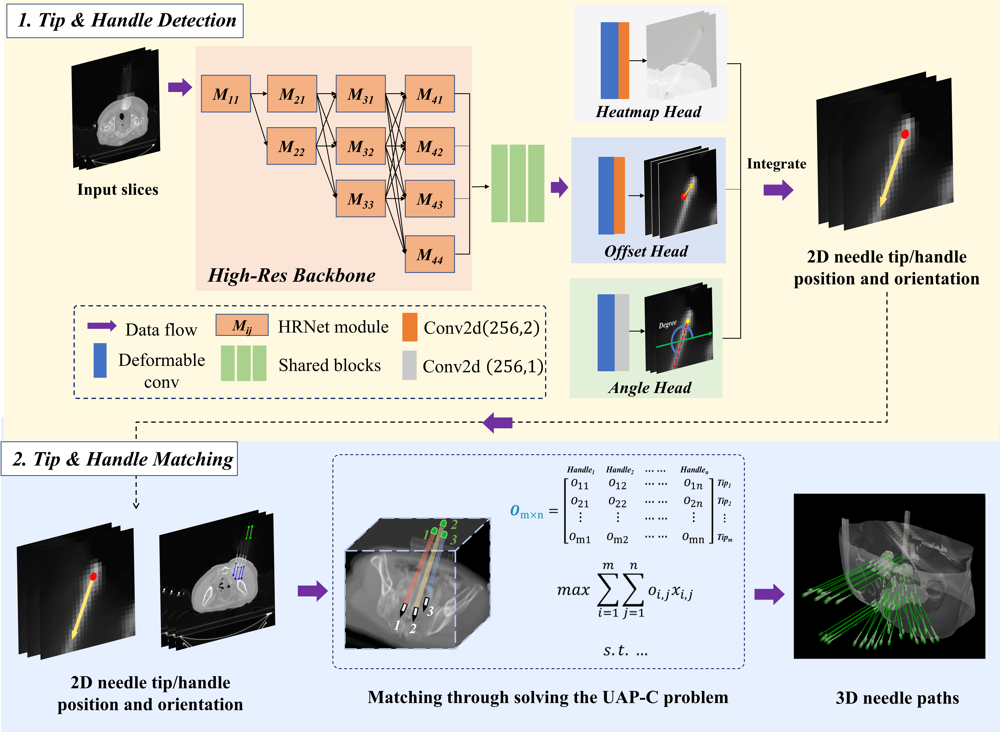

# CTNeedleLocalization

[](https://doi.org/10.1109/JBHI.2026.3694701)

## 🎬 Demo

https://github.com/user-attachments/assets/ca84774f-ba94-48ad-9b75-8b2e26e57bd3
---

🎉 **News:** This work has been officially accepted by the **IEEE Journal of Biomedical and Health Informatics (JBHI)**!

Official Code of  **“Multi-needle Localization for Pelvic Seed Implant Brachytherapy based on Tip-handle Detection and Matching”**

---

## 📝 Citation

If you find this work or code useful for your research, please cite our paper:

```bibtex
@ARTICLE{11523703,
  author={Xiao, Zhuo and Zhou, Fugen and Wang, Jingjing and He, Chongyu and Liu, Bo and Sun, Haitao and Ji, Zhe and Jiang, Yuliang and Wang, Junjie and Wu, Qiuwen},
  journal={IEEE Journal of Biomedical and Health Informatics}, 
  title={Multi-needle Localization for Pelvic Seed Implant Brachytherapy based on Tip-handle Detection and Matching}, 
  year={2026},
  volume={},
  number={},
  pages={1-14},
  keywords={Needles;Signal detection;Location awareness;Brachytherapy;Seeds (agriculture);Modeling;Merging;Head;Implants;Trajectory;Multi-needle localization;object detection;CT images;unbalanced assignment problem with constraints;brachytherapy},
  doi={10.1109/JBHI.2026.3694701}
}
```

---

## 📌 Overview

This repository provides a complete pipeline for **automatic multi-needle localization in intraoperative CT** for pelvic seed implant brachytherapy.

The framework consists of two stages:

1. **2D Detection**  
   Slice-wise detection of needle tips and handles.

2. **3D Matching and Reconstruction**  
   Greedy matching and merging of tip–handle pairs to reconstruct full 3D needle trajectories.

---

## 🔄 Workflow

The overall workflow of the proposed method is illustrated below.



The pipeline starts from intraoperative CT acquisition, followed by slice-wise 2D detection of needle tips and handles, and finally reconstructs complete 3D needle trajectories through greedy matching and merging.

---

## 1️⃣ 2D Detection

### Reference and Acknowledgement

The 2D detection module in this project is implemented with reference to the following open-source projects:

- **CircleNet**  
  https://github.com/hrlblab/CircleNet

- **CenterNet**  
  https://github.com/xingyizhou/CenterNet

- **HRNet**  
  https://github.com/HRNet/HRNet-Semantic-Segmentation

We sincerely thank the authors for making their work publicly available.

---

### Installation

Please follow the official CircleNet installation guide:

https://github.com/hrlblab/CircleNet/blob/master/docs/INSTALL2023.md

The environment configuration described in that document has been verified to work with this project.

---

## 2️⃣ 3D Matching and Needle Reconstruction

Relevant files:

- `match3d_utils.py`
- `match3d_batch.py`

### Input Format

`match3d_batch.py` operates on a case-level directory structure:

```text
case_xxx/
├── ct.mha              # Original CT volume
└── pred_2d.json        # 2D detection results
```

---

### Usage

```bash
python match3d_batch.py   --root /path/to/cases_root   --n_prior <number_of_needles>
```

---

### Output

For each case, the module generates:

```text
pred_3d.json
```

The output contains reconstructed 3D needle trajectories, matched tip–handle pairs, and final matching scores.

---

## 🧠 Pretrained Weights

- Download link: **[Baidu Netdisk](https://pan.baidu.com/s/1AAaDUe890DdsZ_dx7lJCSw?pwd=wb3e)** (Password: `wb3e`)

---

## 📄 License

This project is released under the **MIT License**.
